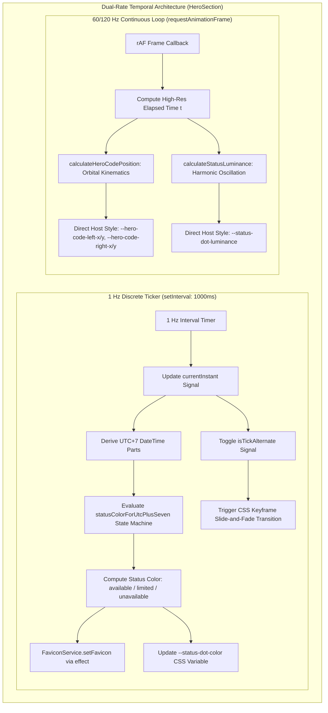
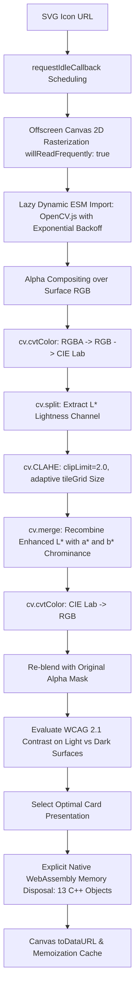
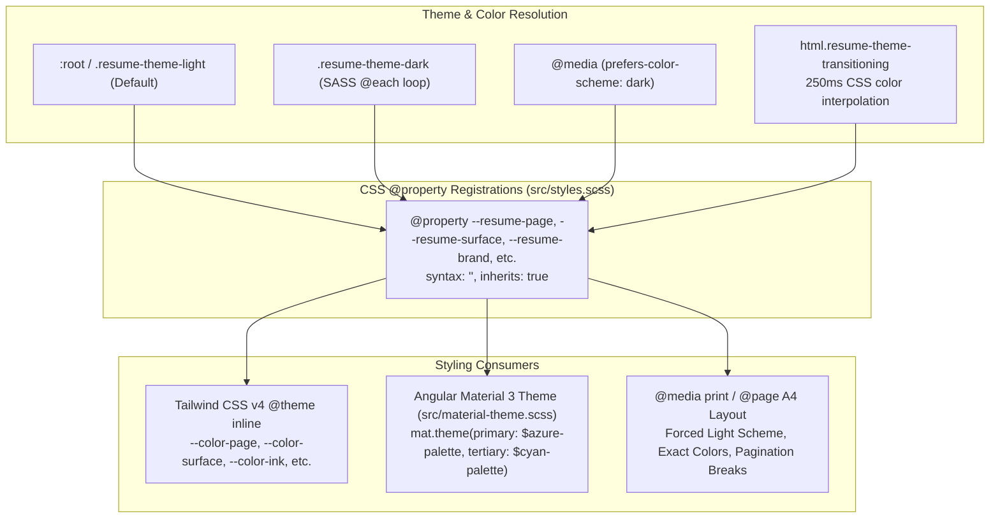

[](https://www.digitalocean.com/?refcode=e2085a54adea&utm_campaign=Referral_Invite&utm_medium=Referral_Program&utm_source=badge)
<br><br><br>
[](https://github.com/prettier/prettier)
[](https://github.com/nawaphonOHM/resume/actions/workflows/dependabot/dependabot-updates)
[](https://angular.dev/)
[](https://www.typescriptlang.org/)
[](https://tailwindcss.com/)
[](https://vitest.dev/)
[](https://nodejs.org/)

## Key Features

- **Angular 22 Signals Architecture**: Standalone component model with default `OnPush` change detection, fine-grained Signal state (`signal`, `computed`, `effect`, `linkedSignal`, `resource`), Signal inputs/outputs (`input.required`, `output`), and native control flow (`@if`, `@for`, `@switch`, `@defer`).
- **Inverted Dependency Injection**: Strict decoupling of data tokens, utility functions, physical constants, and UI components via 60+ granular `InjectionToken` definitions in `src/app/helper/injection-token/`.
- **Live UTC+7 Bangkok Clock & Dynamic Status Favicon**: Real-time availability engine that tracks working hours in Asia/Bangkok time, drives status dot harmonic luminance oscillation ($f = 0.5\text{ Hz}$), and dynamically updates the browser favicon from CDN endpoints (`/favicons/{available|limited|unavailable}/favicon.svg`).
- **Physics-Driven Orbital Badges**: Hero section code badge kinematics computed in 60fps frame loops via parametric trigonometry ($x = r \cos(\omega t + \phi)$, $y = r \sin(\omega t + \phi)$) with starter positions seeded by current Unix epoch time in seconds (`Date.now() / 1000`), continuous animation time integration ($t = t_{\text{unixStart}} + t_{\text{elapsed}}$), and deterministic frequency derived from the calendar day of the month ($f = \text{dayOfMonth} / 3600\text{ Hz}$).
- **Client-Side OpenCV.js CLAHE Image Enhancement**: Real-time contrast optimization for dark technology icons using WebAssembly CLAHE in CIE $L^*a^*b^*$ color space with cooperative idle scheduling (`requestIdleCallback`) and explicit C++ memory management.
- **Smart Image Zoom Previews**: Image preview overlay powered by Angular CDK Overlay with `ResizeObserver`-driven downscale detection and automatic viewport collision containment.
- **Resilient Streaming PDF Download & Pre-Flight Verification**: User-triggered résumé PDF download featuring pre-flight remote asset availability verification (`HEAD` request), reactive availability status signaling (`isAvailable`), accessible confirmation alert dialog (`ResumePdfConfirmDialog`) for proceeding with unverified or unavailable assets, Angular `HttpClient` event streaming with real-time percentage progress tracking, and automatic object URL cleanup.
- **Material 3 Theme System & Print Foundation**: CSS `@property` color token interpolation supporting Light, Dark, and System modes with dedicated A4 print layout stylesheets and WCAG AA accessibility compliance.

## Technology Stack

| Category                 | Technology / Package                                                                    | Version      | Purpose / Architectural Role                                                       |
| :----------------------- | :-------------------------------------------------------------------------------------- | :----------- | :--------------------------------------------------------------------------------- |
| **Core Framework**       | [Angular](https://angular.dev/) (`@angular/core`)                                       | `^22.1.6`    | Reactive web application framework with Signals & standalone components            |
| **UI Components**        | [Angular Material](https://material.angular.io/) (`@angular/material`)                  | `^22.1.6`    | Material 3 UI component system (buttons, navigation, progress spinners)            |
| **Component CDK**        | [Angular CDK](https://material.angular.io/cdk/categories) (`@angular/cdk`)              | `^22.1.6`    | Overlay popovers, accessibility primitives, and layout utilities                   |
| **Styling Engine**       | [Tailwind CSS](https://tailwindcss.com/) (`tailwindcss`, `@tailwindcss/postcss`)        | `^4.3.3`     | Utility-first CSS v4 engine with `@theme inline` and custom properties             |
| **Programming Language** | [TypeScript](https://www.typescriptlang.org/) (`typescript`)                            | `~6.0.2`     | Strongly-typed JavaScript with strict type checking and modern ECMAScript features |
| **Build & Dev Tooling**  | [Angular CLI & Build](https://angular.dev/tools/cli) (`@angular/build`, `@angular/cli`) | `^22.1.8`    | Application bundler and Vite/esbuild development server                            |
| **Unit Testing**         | [Vitest](https://vitest.dev/) (`vitest`, `@angular/build:unit-test`, `jsdom`)           | `^4.1.11`    | High-performance unit test runner executing in simulated DOM environment           |
| **Reactive Streams**     | [RxJS](https://rxjs.dev/) (`rxjs`)                                                      | `~7.8.0`     | Asynchronous event streams, HTTP progress event observation, and timers            |
| **Code Formatting**      | [Prettier](https://prettier.io/) (`prettier`)                                           | `^3.8.1`     | Multi-language code formatter for TypeScript, HTML, SCSS, JSON, and Markdown       |
| **Dependency Analysis**  | [Skott](https://github.com/antoine-coulon/skott) (`skott`)                              | `^0.35.11`   | Architectural dependency graph visualization and cycle detection                   |
| **Computer Vision**      | [OpenCV.js](https://docs.opencv.org/) (`@techstark/opencv-js` via CDN)                  | jsDelivr ESM | Client-side WebAssembly CLAHE contrast enhancement pipeline                        |
| **Iconography**          | [Google Material Icons](https://fonts.google.com/icons) (`material-icons`)              | `^1.13.14`   | Material design system icon font                                                   |
| **Runtime Environment**  | [Node.js](https://nodejs.org/)                                                          | `>=22.22.3`  | JavaScript runtime environment (compatible with Node.js 22 LTS and Node.js 24)     |
| **Package Manager**      | [npm](https://www.npmjs.com/)                                                           | `10.9.8`     | Project package manager and script execution engine                                |

## Requirements & Prerequisites

- **Node.js**: Version `22.22.3` or newer (configured in `package.json` engines as `>=22.22.3`; Node.js 22 LTS or Node.js 24 recommended).
- **npm**: Version `10.9.8` or compatible npm 10+.
- **Browser Compatibility**: Modern evergreen browsers supporting WebAssembly, Canvas 2D rasterization, CSS Custom Properties with `@property` registration, and ES2022+ modules.

## Getting Started

### 1. Clone & Install Dependencies

```bash
npm ci
```

### 2. Start Local Development Server

```bash
npm start
```

Navigate to `http://localhost:4200/`. The development server supports live reloading and hot module replacement as source files are modified.

## Architecture & Core Design Patterns

The application is structured around modern Angular standalone architecture, fine-grained Signal reactivity, Inverted Dependency Injection via modular `InjectionToken`s, computer vision algorithms, and real-time kinematic calculations.

```mermaid
graph TD
    subgraph Entry["Application Shell"]
        MAIN["main.ts"] --> APP["App (app.ts)"]
        MAIN --> APP_CONFIG["appConfig (app.config.ts)"]
        APP_CONFIG --> ROUTES["routes (app.routes.ts)"]
    end

    subgraph PageLayer["Routed Page & Presentational Sections"]
        ROUTES -->|loadComponent| RESUME_PAGE["ResumePage<br/>resume-page.ts"]
        RESUME_PAGE --> NAV["ResumeNavigation"]
        NAV -.->|themeToggled| RESUME_PAGE
        NAV -.->|downloadRequested| RESUME_PAGE
        RESUME_PAGE -.->|confirm on unavailable| PDF_DIALOG["ResumePdfConfirmDialog<br/>dialog/resume-pdf-confirm-dialog/"]
        RESUME_PAGE --> HERO["HeroSection"]
        RESUME_PAGE --> SUMMARY["SummarySection"]
        RESUME_PAGE --> EXPERIENCE["ExperienceTimeline"]
        RESUME_PAGE --> EDUCATION["EducationSection"]
        RESUME_PAGE --> PROFILE["ProfileSidebar"]
        EXPERIENCE --> TECHNOLOGY_ICON["TechnologyIconComponent"]
    end

    subgraph Interactive["Directives, Services & Overlays"]
        EXPERIENCE -.->|appImageZoom| ZOOM_DIRECTIVE["ImageZoomDirective"]
        EDUCATION -.->|appImageZoom| ZOOM_DIRECTIVE
        PROFILE -.->|appImageZoom| ZOOM_DIRECTIVE
        TECHNOLOGY_ICON -.->|appImageZoom| ZOOM_DIRECTIVE
        ZOOM_DIRECTIVE --> ZOOM_SERVICE["ImageZoomService"]
        ZOOM_SERVICE -->|CDK Overlay| ZOOM_PREVIEW["ImageZoomPreview"]
        RESUME_PAGE --> THEME_SERVICE["ThemeService"]
        RESUME_PAGE --> PDF_SERVICE["ResumePdfService<br/>HEAD pre-flight & GET stream"]
        TECHNOLOGY_ICON --> CONTRAST_SERVICE["TechnologyIconContrastService"]
        RESUME_PAGE --> CDK_SCROLL["CDK ScrollDispatcher & ViewportRuler<br/>Scanline Collision Scroll-Spy"]
    end

    subgraph DataTokens["Canonical Data & Fine-Grained Injection Tokens"]
        RESUME_DATA["resumeData<br/>resume.data.ts"] --> RESUME_PAGE
        PDF_URL["RESUME_PDF_DOWNLOAD_URL"] --> PDF_SERVICE
        PDF_NAME["RESUME_PDF_FILENAME"] --> PDF_SERVICE
        SECTIONS_TOKEN["RESUME_SECTIONS"] --> RESUME_PAGE
        SECTIONS_TOKEN --> NAV
        HERO_MATH["HERO_CODE_* & Kinematics Tokens"] --> HERO
        STATUS_MATH["STATUS_LUMINANCE_* & UTC+7 Tokens"] --> HERO
        CONTRAST_TOKENS["CLAHE, OpenCV & Color Tokens"] --> CONTRAST_SERVICE
        OVERLAY_TOKENS["VIEWPORT_MARGIN, ORIGIN_GAP Tokens"] --> ZOOM_SERVICE
    end

    subgraph External["External Assets & CDN Runtimes"]
        PDF_SERVICE -.->|HEAD check & GET stream| PDF_ASSET["DigitalOcean Spaces CDN<br/>Hosted PDF Asset"]
        CONTRAST_SERVICE -.->|lazy ESM import| OPENCV_CDN["jsDelivr CDN<br/>@techstark/opencv-js"]
        EXPERIENCE -.->|remote images| DO_SPACES["DigitalOcean Spaces CDN<br/>image assets"]
        EDUCATION -.->|remote images| DO_SPACES
        PROFILE -.->|remote images| DO_SPACES
        TECHNOLOGY_ICON -.->|remote icons| DO_SPACES
        HERO -.->|dynamic favicon link| FAVICON_CDN["DigitalOcean Spaces CDN<br/>/favicons/{status}/favicon.svg"]
    end
```



### 1. Modern Angular 22 Architecture & Reactivity Principles

The application fully embraces modern Angular 22 standalone architecture, fine-grained Signal reactivity, and ergonomic framework primitives:

- **Standalone Components by Default**: All components, directives, and pipes in the codebase are standalone. Modern Angular eliminates `NgModule` declarations and treats standalone as the default, avoiding redundant `standalone: true` decorator flags.
- **OnPush Change Detection by Default**: In Angular v22+, `ChangeDetectionStrategy.OnPush` is the default change detection strategy across the application. Components operate with optimal performance and zoneless readiness without explicit `changeDetection` decorator boilerplate.
- **Signal-Based Reactive State Management**:
  - **Writable Signals (`signal`)**: Reactive state containers for component and service state (`activeSection`, `currentInstant`, `downloadProgress`, `renderAllSections`).
  - **Derived Reactive State (`computed`)**: Pure computations (such as theme dark/light status, active section navigation, dynamic fallback presentations, and photometry) recalculate on-demand when dependent signals change.
  - **Linked Reactive State (`linkedSignal`)**: `TechnologyIconComponent` employs `linkedSignal` to automatically reset image loading state whenever the underlying logo image source URL changes:
    ```typescript
    protected readonly isLoading = linkedSignal<string, boolean>({
      source: () => this.presentation().logo.src,
      computation: () => true,
    });
    ```
  - **Asynchronous Data Resources (`resource`)**: `TechnologyIconComponent` utilizes Angular's `resource()` API with `params` and `loader` definitions to asynchronously coordinate client-side OpenCV CLAHE contrast optimizations.
  - **Reactive Side Effects (`effect`)**: `HeroSection` uses `effect()` to synchronize the dynamic availability status color with `document.head` favicon links via `FaviconService`, and `ImageZoomDirective` uses `effect()` to cleanly tear down CDK overlay preview state on cleanup.
- **Signal-Based Inputs & Outputs**: All components consume props via `input.required<T>()` and `input<T>()`, and emit events using `output<T>()`, eliminating legacy `@Input` and `@Output` decorators.
- **Modern `@Service()` Decorators & Functional Injection**:
  - Singleton root services (such as `ThemeService` and `FaviconService`) leverage the modern Angular v22 `@Service()` decorator, standardizing clean dependency injection over legacy `@Injectable({ providedIn: 'root' })`.
  - Dependencies are injected cleanly at the declaration site via `inject()` rather than constructor injection parameters.
- **Component Host Properties**: Component and directive host classes, style bindings, accessibility attributes, and window event listeners (such as `'(window:beforeprint)': 'prepareForNativePrint()'`) are declared directly in the `host` metadata object of the `@Component` and `@Directive` decorators instead of deprecated `@HostBinding` or `@HostListener` decorators.
- **Native Control Flow & Progressive Deferral (`@defer`)**:
  - All Angular HTML templates use native `@if`, `@else`, `@for (item of items; track item.id)`, and `@switch` blocks, avoiding legacy structural directives (`*ngIf`, `*ngFor`).
  - Section components (`SummarySection`, `ExperienceTimeline`, `EducationSection`, `ProfileSidebar`) utilize viewport-driven template deferral via `@defer (on viewport; when renderAllSections())` with accessible `@placeholder` skeleton spinners and graceful `@error` fallback UI blocks.
- **Angular CDK Primitives**:
  - `@angular/cdk/scrolling`: `ScrollDispatcher` and `ViewportRuler` power the scanline collision and distance model for real-time viewport tracking.
  - `@angular/cdk/overlay` & `@angular/cdk/portal`: `Overlay`, `OverlayRef`, and `ComponentPortal` power the smart image zoom preview popover with connected positioning strategies.

### 2. Inverted Dependency Injection Architecture

Rather than relying on large monolithic service classes with hardcoded configuration constants, the application adheres to strict **Inverted Dependency Injection (Inverted DI)**. Over 60 fine-grained `InjectionToken` definitions reside in `src/app/helper/injection-token/`, decoupling parameters, math formulas, timing constants, pure transformation functions, and CDN URLs:

- **Kinematics & Orbital Badges**: `HERO_CODE_R_LEFT`, `HERO_CODE_R_RIGHT`, `HERO_CODE_PHI_LEFT`, `HERO_CODE_PHI_RIGHT`, `HERO_CODE_F`, `HERO_CODE_OMEGA`, `calculateHeroCodePosition`.
- **Availability Scheduling & Photometry**: `UTC_PLUS_SEVEN_OFFSET_MS`, `CLOCK_UPDATE_INTERVAL_MS`, `STATUS_LUMINANCE_A`, `STATUS_LUMINANCE_F`, `STATUS_LUMINANCE_OMEGA`, `STATUS_LUMINANCE_PHI`, `calculateStatusLuminance`, `statusColor`, `statusColorForUtcPlusSeven`, `statusFaviconForStatusColor`.
- **Computer Vision & CLAHE**: `OPEN_CV_CDN_URL`, `TECHNOLOGY_ICON_OPEN_CV_LOADER`, `CLAHE_CLIP_LIMIT`, `CLAHE_TILE_PIXEL_TARGET`, `MIN_CLAHE_TILES`, `MAX_CLAHE_TILES`, `IDLE_TIMEOUT_MS`, `OPEN_CV_RETRY_COUNT`, `OPEN_CV_RETRY_DELAY_MS`, `OPEN_CV_RETRY_DELAY_MULTIPLIER`, `OPEN_CV_RETRY_JITTER_MS`, `dispose`, `normalizeOpenCvExport`, `linearizeChannel`, `relativeLuminance`.
- **Overlay & Geometry**: `VIEWPORT_MARGIN`, `IMAGE_MAX_VIEWPORT_RATIO`, `ORIGIN_GAP`, `PANEL_CHROME_PX`, `IMAGE_ZOOM_POSITIONS`, `IMAGE_ZOOM_PREVIEW_DATA`, `DOWNSCALE_TOLERANCE`, `INITIAL_IMAGE_STATE`.
- **Theme & Storage**: `RESUME_THEME_STORAGE_KEY`, `THEME_CLASSES`, `THEME_TRANSITION_CLASS`, `THEME_TRANSITION_DURATION_MS`.
- **PDF & Navigation**: `RESUME_PDF_DOWNLOAD_URL`, `RESUME_PDF_FILENAME`, `RESUME_SECTIONS`, `SECTION_ACTIVATION_RATIO`, `VIEWPORT_EVENT_THROTTLE_MS`, `resumeData`.

**Architectural Benefits:**

1. **Isolated Single Responsibility**: Each file exports exactly one token or pure functional helper.
2. **Granular Testability**: Unit tests can override any single parameter (e.g., `CLAHE_CLIP_LIMIT` or `UTC_PLUS_SEVEN_OFFSET_MS`) in Angular `TestBed` providers without mocking entire classes.
3. **Tree-Shaking & Bundle Optimization**: Unused configurations are automatically pruned during production compilation.

### 3. Hero Section Dual-Rate Temporal Architecture & Live Availability Engine

The Hero Section (`src/app/resume/hero-section/hero-section.ts`) implements an interactive, dual-rate temporal architecture separating discrete temporal state transitions from continuous 60/120 Hz animation physics:



#### A. Discrete 1 Hz Clock Ticker & Keyframe Slide Transitions

- **Ticker Loop**: Controlled by `CLOCK_UPDATE_INTERVAL_MS = 1000ms`. Every second, the ticker updates the `currentInstant` signal with the current timestamp.
- **Alternating Slide-and-Fade Transitions**: Flips the boolean signal `isTickAlternate.update((v) => !v)` on each tick. The template binds this state to trigger alternating CSS keyframe animations (`hero-clock-tick-a` and `hero-clock-tick-b`), delivering smooth slide-in and fade-out transitions without layout reflows or DOM recreation.
- **Asia/Bangkok (UTC+7) Availability State Machine**: Evaluates current time using a fixed offset $+7\text{ hours} = 25,200,000\text{ ms}$ (`UTC_PLUS_SEVEN_OFFSET_MS`) to compute candidate availability status:

| Day Type               | Time Window (UTC+7) | Status State  | Semantic Color    | Work Context                  |
| :--------------------- | :------------------ | :------------ | :---------------- | :---------------------------- |
| **Weekdays (Mon–Fri)** | `06:00 – 09:00`     | `limited`     | `#F7A600` (Amber) | Morning flex & preparation    |
|                        | `09:00 – 12:00`     | `available`   | `#92C353` (Green) | Core focus & collaboration    |
|                        | `12:00 – 13:00`     | `limited`     | `#F7A600` (Amber) | Lunch break                   |
|                        | `13:00 – 18:00`     | `available`   | `#92C353` (Green) | Core development & delivery   |
|                        | `18:00 – 22:00`     | `limited`     | `#F7A600` (Amber) | Evening flexible availability |
|                        | `22:00 – 06:00`     | `unavailable` | `#D1D1D1` (Gray)  | Rest & offline                |
| **Weekends (Sat–Sun)** | `06:00 – 22:00`     | `limited`     | `#F7A600` (Amber) | Weekend flexible availability |
|                        | `22:00 – 06:00`     | `unavailable` | `#D1D1D1` (Gray)  | Rest & offline                |

- **Reactive Favicon Synchronization**: An Angular `effect()` listens to the dynamic status color and invokes `FaviconService.setFavicon()`, updating the `<link rel="icon">` element in `document.head` to point to the corresponding remote SVG endpoint on DigitalOcean Spaces.

#### B. Continuous 60/120 Hz Orbital Kinematics & Photometric Pulsation

Driven by `requestAnimationFrame` and executed after initial render (`afterNextRender`), the continuous loop calculates smooth sub-pixel kinematics and photometric luminance without triggering Angular change detection cycles:

- **Parametric Circular Orbital Kinematics & Starter Coordinates**:
  The hero code badges orbit continuously around the central avatar along parametric circular paths. At component instantiation, the initial starter coordinates are computed directly from the current Unix epoch timestamp in seconds ($t_{\text{unixStart}} = \text{Date.now()} / 1000$), after which continuous frame callbacks advance position at $t = t_{\text{unixStart}} + t_{\text{elapsed}}$ (where $t_{\text{elapsed}} = (t_{\text{current}} - t_{\text{start}}) / 1000$ via `performance.now()`). The left badge orbital frequency is scaled by the radius ratio ($r_{\text{right}} / r_{\text{left}}$):
  $$\theta_{\text{left}}(t) = \omega\left(f \cdot \frac{r_{\text{right}}}{r_{\text{left}}}\right) \cdot t + \phi_{\text{left}}$$
  $$x_{\text{left}}(t) = r_{\text{left}} \cdot \cos(\theta_{\text{left}}(t)), \quad y_{\text{left}}(t) = r_{\text{left}} \cdot \sin(\theta_{\text{left}}(t))$$
  $$\theta_{\text{right}}(t) = \omega(f) \cdot t + \phi_{\text{right}}$$
  $$x_{\text{right}}(t) = r_{\text{right}} \cdot \cos(\theta_{\text{right}}(t)), \quad y_{\text{right}}(t) = r_{\text{right}} \cdot \sin(\theta_{\text{right}}(t))$$

- **Physical & Mathematical Parameters**:
  - **Orbital Radii ($r$)**: $r_{\text{left}} = 37\%$ (`HERO_CODE_R_LEFT`), $r_{\text{right}} = 50\%$ (`HERO_CODE_R_RIGHT`)
  - **Phase Offsets ($\phi$)**: $\phi_{\text{left}} = \frac{7\pi}{6}\text{ rad} = 210^\circ$ (`HERO_CODE_PHI_LEFT`), $\phi_{\text{right}} = \frac{\pi}{6}\text{ rad} = 30^\circ$ (`HERO_CODE_PHI_RIGHT`)
  - **Dynamic Calendar Frequency ($f$)**: Derived from the current day of the month in UTC+7 (`HERO_CODE_F`):
    $$f = \frac{\text{dayOfMonth}}{\text{secondsPerHour}} = \frac{\text{dayOfMonth}}{3600}\text{ Hz}$$
    _(e.g., day 1 rotates at $1\text{ rev/hour}$, day 31 rotates at $31\text{ rev/hour}$)_.
  - **Angular Velocity Function ($\omega(f)$)**: $\omega(f) = 2\pi f$ (`HERO_CODE_OMEGA`).

- **Harmonic Status Dot Luminance Pulsation**:
  The status indicator dot pulses with continuous harmonic luminance:
  $$L(t) = \operatorname{clamp}\left(0.5 + A \cdot \cos(\omega t + \phi), 0, 1\right)$$
  where $A = 0.5$ (`STATUS_LUMINANCE_A`), $f = 0.5\text{ Hz}$ (`STATUS_LUMINANCE_F`, period $T = 2\text{ s}$), $\omega = \pi\text{ rad/s}$ (`STATUS_LUMINANCE_OMEGA`), and $\phi = 0\text{ rad}$ (`STATUS_LUMINANCE_PHI`).
  The calculated value is written directly to `--status-dot-luminance` on the host element.

- **Lifecycle & Motion Reduction**:
  - Automatically registered via `afterNextRender` and cleaned up in `DestroyRef.onDestroy(() => { clearInterval(clockTimer); cancelAnimationFrame(rafId); })`.
  - Under `@media (prefers-reduced-motion: reduce)`, coordinates and luminance lock to static defaults ($x_{\text{left}}=-32.04\%, y_{\text{left}}=-18.5\%, x_{\text{right}}=43.3\%, y_{\text{right}}=25\%, L=0.5$).

### 4. Client-Side OpenCV.js CLAHE Image Enhancement Pipeline

`TechnologyIconContrastService` (`src/app/resume/experience-timeline/technology-icon/service/technology-icon-contrast/technology-icon-contrast.service.ts`) optimizes low-contrast dark technology marks directly in the user's browser using WebAssembly computer vision:



1. **Cooperative Idle Scheduling**: Defers processing via `requestIdleCallback` (`IDLE_TIMEOUT_MS = 1000ms`), preventing main-thread contention during initial page load.
2. **Lazy ESM Import & Retry Loop**: Dynamically imports `@techstark/opencv-js` from jsDelivr CDN (`https://cdn.jsdelivr.net/npm/@techstark/opencv-js/+esm`) on demand, utilizing configured retry parameters (`OPEN_CV_RETRY_COUNT = 3`, `OPEN_CV_RETRY_DELAY_MS = 1000ms`, `OPEN_CV_RETRY_DELAY_MULTIPLIER = 1.0`, `OPEN_CV_RETRY_JITTER_MS = 0`) with cache-busting query strings (`?retry=${retry}`).
3. **Canvas 2D Rasterization & Color Space Transformation**:
   - Rasterizes remote SVG icons asynchronously onto an `HTMLCanvasElement` configured with `{ willReadFrequently: true }`.
   - Converts raw 4-channel RGBA pixels $\to$ 3-channel RGB $\to$ CIE $L^*a^*b^*$ (`cv.cvtColor`), decoupling perceptual lightness ($L^*$) from chromaticity ($a^*, b^*$).
4. **Adaptive Tile Grid CLAHE Equalization**:
   Calculates local tile grid dimensions based on target tile pixel size ($16\text{px}$) clamped between $2$ and $8$ tiles:
   $$\text{tileCount}(\text{dimension}) = \max\left(\text{minTiles}, \min\left(\text{maxTiles}, \left\lceil \frac{\text{dimension}}{\text{pixelTarget}} \right\rceil\right)\right)$$
   Applies `cv.CLAHE(clipLimit = 2.0, tileGrid)` exclusively to the isolated $L^*$ channel, equalizing local contrast while preserving original brand colors.
5. **Dual Candidate Surface Scoring via Alpha-Weighted WCAG 2.1 Contrast**:
   Evaluates original and enhanced marks across `LightSurface` (`#ffffff`, RGB `[255, 255, 255]`) and `DarkSurface` (`#0d1b2d`, RGB `[13, 27, 45]`).
   Computes alpha-weighted WCAG 2.1 relative luminance contrast:
   $$\text{Score} = \frac{\sum_{i \in \text{opaque pixels}} \left( \text{Contrast}(L_{\text{fg}, i}, L_{\text{bg}}) \cdot \alpha_i \right)}{\sum_{i \in \text{opaque pixels}} \alpha_i}$$
   where $\text{Contrast}(L_1, L_2) = \frac{\max(L_1, L_2) + 0.05}{\min(L_1, L_2) + 0.05}$, and relative luminance $L = 0.2126 R_{\text{lin}} + 0.7152 G_{\text{lin}} + 0.0722 B_{\text{lin}}$ with standard sRGB gamma linearization.
6. **Strict Native WebAssembly Memory Disposal**:
   JavaScript garbage collection cannot reclaim native C++ allocations in the WebAssembly heap. The service explicitly frees all 13 allocated OpenCV instances (`cv.Mat`, `cv.MatVector`, `cv.Size`, `cv.CLAHE`) in `finally` blocks via `dispose()` and `.delete()`.
7. **Signal Resource Integration**:
   `TechnologyIconComponent` coordinates contrast enhancement using Angular's declarative `resource()` API, resetting image loading state reactively via `linkedSignal()`.

### 5. Viewport Scroll-Spy Navigation & Scanline Collision System

Located in `ResumePage` (`src/app/resume/resume-page/resume-page.ts`) and `ResumeNavigation` (`src/app/resume/resume-navigation/`):

```mermaid
flowchart TD
    SCROLL[CDK ScrollDispatcher.scrolled] --> MERGE[merge stream]
    RESIZE[CDK ViewportRuler.change] --> MERGE
    MERGE --> THROTTLE[throttleTime: VIEWPORT_EVENT_THROTTLE_MS = 100ms]
    THROTTLE --> SCANLINE[Compute Virtual Activation Scanline: top + height * 0.18]
    SCANLINE --> BOUNDS[Collect Section Bounding Rects in Document Space]
    BOUNDS --> CULL{Frustum Culling: bottom > vp.top AND top < vp.bottom}
    CULL -->|Visible Sections| COLLIDE{Direct Collision: top <= scanline <= bottom}
    COLLIDE -->|Match Found| SET_ACTIVE[activeSection.set: Current Section ID]
    COLLIDE -->|No Direct Match Gap| NEAREST[Sort Visible by |top - scanline|: Select Nearest]
    NEAREST --> SET_ACTIVE
    SET_ACTIVE --> NAV_PILL[Update Navigation Active State & Indicator Pill]
```

- **Merged Reactive Viewport Stream**:
  Combines scrolling events from CDK `ScrollDispatcher` and viewport resize events from CDK `ViewportRuler`, throttled to $100\text{ms}$ (`VIEWPORT_EVENT_THROTTLE_MS`) to eliminate layout thrashing:
  ```typescript
  merge(
    this.scrollDispatcher.scrolled(this.viewportEventThrottleMs),
    this.viewportRuler.change(this.viewportEventThrottleMs),
  );
  ```
- **Proportional Virtual Scanline Projection**:
  Instead of relying on crude viewport midpoints or static pixel offsets, the algorithm projects an activation scanline at $18\%$ from the viewport top (`SECTION_ACTIVATION_RATIO = 0.18`):
  $$\text{activationLine} = \text{viewport.top} + (\text{viewport.height} \cdot \text{sectionActivationRatio})$$
- **Frustum Culling & Document-Space Bounding Evaluation**:
  Extracts document-space bounding rectangles for all registered sections (`RESUME_SECTIONS`: `about`, `experience`, `education`, `skills`, `profile`). Sections outside the viewport frustum ($\text{bottom} \le \text{viewport.top} \lor \text{top} \ge \text{viewport.bottom}$) are culled immediately.
- **Collision Detection & Nearest-Neighbor Euclidean Distance Fallback**:
  1. **Direct Collision**: Checks if any visible section bounding box spans the virtual scanline ($\text{top} \le \text{activationLine} \land \text{bottom} \ge \text{activationLine}$).
  2. **Nearest-Neighbor Fallback**: If the scanline falls within inter-section margins or during rapid scrolling momentum, visible sections are sorted by Euclidean distance $|\text{top} - \text{activationLine}|$, selecting the closest section to guarantee continuous, jitter-free navigation highlighting.
- **URL Fragment & Active State Synchronization**:
  Synchronizes with `ActivatedRoute.fragment` to support direct deep-linking and back/forward browser navigation.

### 6. Smart Image Zoom & Angular CDK Overlay System

Located at `src/app/helper/directive/image-zome/image-zoom.directive.ts` and `src/app/resume/image-zoom-preview/`:

- **Downscale Detection via `ResizeObserver`**:
  `ImageZoomDirective` inspects the host image's natural dimensions against its rendered content box (excluding CSS border and padding):
  $$W_{\text{content}} = W_{\text{bounds}} - (\text{border}_{\text{left}} + \text{border}_{\text{right}} + \text{padding}_{\text{left}} + \text{padding}_{\text{right}})$$
  $$H_{\text{content}} = H_{\text{bounds}} - (\text{border}_{\text{top}} + \text{border}_{\text{bottom}} + \text{padding}_{\text{top}} + \text{padding}_{\text{bottom}})$$
  $$\text{containedScale} = \min\left(\frac{W_{\text{content}}}{\text{naturalWidth}}, \frac{H_{\text{content}}}{\text{naturalHeight}}\right)$$
  An image is marked eligible for zoom if and only if $\text{containedScale} < 1 - \text{DOWNSCALE\_TOLERANCE}$ (with `DOWNSCALE_TOLERANCE = 0.01`). Full-scale, upscaled, or broken images remain inert.
- **Dual Interaction Ownership**:
  - **Pointer Hover Mode**: `pointerenter` opens a hover-owned overlay with `pointer-events: none` on the overlay pane, preventing mouse cursor trap and flickering. `pointerleave` automatically closes hover ownership.
  - **Mobile Touch Mode**: Tap (`click`) toggles an interactive touch-owned overlay panel.
- **Viewport-Bounded CDK Overlay Placement & Clamping Pipeline**:
  `ImageZoomService` positions previews using connected position strategies (`IMAGE_ZOOM_POSITIONS` trying right, left, bottom, top with `ORIGIN_GAP = 12px`), enforces boundary margins (`VIEWPORT_MARGIN = 16px`), accounts for frame padding/borders (`PANEL_CHROME_PX = 26px`), and clamps maximum viewport share (`IMAGE_MAX_VIEWPORT_RATIO = 0.20`).
  A two-phase clamping pipeline (`applyViewportSizeLimits` and `clampOverlayToViewport`) prevents overflow when wide previews render near scrollbars or viewport edges.
- **Global Dismissals**: Subscribes to outside pointer events, `Escape` keypresses, route navigation, and directive destruction.

### 7. Resilient On-Demand Streaming PDF Download Pipeline

Located at `src/app/resume/resume-page/service/resume-pdf/resume-pdf.service.ts` and `src/app/resume/resume-page/dialog/resume-pdf-confirm-dialog/`:

- **Pre-Flight Remote Asset Availability Verification (`checkAvailability`)**:
  When running in a browser environment (`isPlatformBrowser(this.platformId)`), `ResumePdfService` automatically initiates an asynchronous `HEAD` request to `RESUME_PDF_DOWNLOAD_URL` to verify whether the hosted asset returns an active `2xx` HTTP response status. The state is published via a reactive read-only signal:
  ```typescript
  readonly isAvailable: Signal<boolean | null> = this._isAvailable.asReadonly();
  ```
  where `null` represents verification in progress, `true` confirms asset availability, and `false` handles network errors, non-2xx status codes, or non-browser (SSR) execution.
- **Visual Warning & Responsive Navigation States**:
  `ResumeNavigation` receives the `downloadAvailable` input signal to dynamically adjust its action indicators:
  - When unavailable (`downloadAvailable() === false`), the download trigger displays a `file_download_off` Material icon with a tooltip (_"Resume PDF might be unavailable. Click to confirm download anyway."_) and an accessibility label (_"Download résumé as PDF (file may be unavailable)"_).
  - When verified or checking, standard `download` iconography and labels are shown.
- **Accessible Confirmation Dialog (`ResumePdfConfirmDialog`)**:
  If a user initiates a download while `downloadAvailable() === false`, `ResumePage` intercepts the request and opens `ResumePdfConfirmDialog` configured with `{ role: 'alertdialog', disableClose: true }`:
  - **Modal Persistence (`disableClose: true`)**: Disables outside/backdrop clicks and Escape dismissal to enforce explicit user resolution through modal action buttons.
  - **Cancel**: Emits `false` (`ResumePdfConfirmDialogResult`), aborting the download without triggering network requests or pending progress states.
  - **Continue**: Emits `true`, allowing the user to proceed with the binary streaming request.
- **Single-Flight Request Locking**:
  `ResumePage.downloadResume()` manages the `downloadPending` boolean signal. Concurrent download attempts while a stream is in-flight are rejected immediately to prevent network saturation, while `ResumePdfService` remains responsible for the HTTP stream itself.
- **HTTP Event Streaming & Progress Observation**:
  Streams the remote résumé PDF (`https://resume-images.ohm-mho.space/downloadable-resume/Nawaphon_Isarathanachaikul.pdf`) via Angular `HttpClient` using `{ reportDownloadProgress: true, observe: 'events', responseType: 'blob' }`.
- **Live Percentage Calculation**:
  Observes `HttpEventType.DownloadProgress` events, calculating real-time download percentage as:
  $$\text{percentage} = \min\left(100, \max\left(0, \operatorname{round}\left(\frac{\text{loaded}}{\text{total}} \times 100\right)\right)\right)$$
  Emits `null` when `Content-Length` is absent (indeterminate stream).
- **Dynamic Spinner UI States**:
  - Renders `mat-progress-spinner` in `mode="indeterminate"` while establishing the HTTP stream or when the `total` content length is indeterminate.
  - Smoothly transitions to `mode="determinate"` with `[value]="downloadProgress()"` as streamed data arrives.
  - Emits live `aria-busy="true"` and descriptive `aria-label` updates (_"Downloading résumé PDF (45%)"_).
- **Blob Download & Guaranteed Object URL Revocation**:
  Constructs a temporary anchor element to trigger browser file saving (`nawaphon-isarathanachaikul-resume-profile.pdf`), ensuring deterministic `window.URL.revokeObjectURL(objectUrl)` cleanup in a `finally` block.

---

## Styling Architecture & Design Tokens

The styling architecture leverages modern CSS standards, CSS Custom Properties with native `@property` registration, Tailwind CSS v4, Angular Material 3, and dedicated A4 print stylesheets.



### 1. CSS `@property` Design Token System

Standard CSS custom properties normally treat color changes as discrete, non-interpolatable string substitutions. By formally registering each semantic custom property with `@property` in `src/styles.scss`, the browser's CSS layout engine understands their computational syntax (`syntax: '<color>'`), allowing smooth color transitions:

```scss
@property --resume-page {
  syntax: '<color>';
  inherits: true;
  initial-value: #f4f7fb;
}

@property --resume-surface {
  syntax: '<color>';
  inherits: true;
  initial-value: #ffffff;
}

@property --resume-text {
  syntax: '<color>';
  inherits: true;
  initial-value: #172033;
}

@property --resume-brand {
  syntax: '<color>';
  inherits: true;
  initial-value: #123b67;
}
```

Registered semantic tokens include:

- Surface & Canvas: `--resume-page`, `--resume-surface`, `--resume-surface-raised`, `--resume-sidebar`
- Typography & Outlines: `--resume-text`, `--resume-muted`, `--resume-border`, `--resume-sidebar-text`
- Brand & Accents: `--resume-brand`, `--resume-brand-strong`, `--resume-brand-soft`, `--resume-accent`
- Interaction & Effects: `--resume-focus`, `--resume-shadow-color`

### 2. Tailwind CSS v4 `@theme inline` Semantic Bridge

Tailwind CSS v4 utilities consume semantic custom properties through `@theme inline` in `src/styles.scss`, establishing a single source of truth without duplicating color constants:

```scss
@theme inline {
  --color-page: var(--resume-page);
  --color-surface: var(--resume-surface);
  --color-surface-raised: var(--resume-surface-raised);
  --color-ink: var(--resume-text);
  --color-muted: var(--resume-muted);
  --color-brand: var(--resume-brand);
  --color-brand-strong: var(--resume-brand-strong);
  --color-brand-soft: var(--resume-brand-soft);
  --color-accent: var(--resume-accent);
  --color-outline: var(--resume-border);
  --color-sidebar: var(--resume-sidebar);
  --color-sidebar-ink: var(--resume-sidebar-text);
  --font-sans: system-ui, -apple-system, BlinkMacSystemFont, 'Segoe UI', sans-serif;
  --font-mono: ui-monospace, SFMono-Regular, Menlo, Monaco, Consolas, monospace;
  --breakpoint-xs: 30rem;
  --container-resume: 75rem;
  --radius-panel: 1.5rem;
  --shadow-soft: var(--resume-shadow);
}
```

### 3. Angular Material 3 Global Theme Configuration

`src/material-theme.scss` configures Angular Material 3 using the modern M3 mixin `@include mat.theme(...)`:

- **Color Palettes**: Primary palette mapped to `mat.$azure-palette`, tertiary accent to `mat.$cyan-palette`, and `theme-type: color-scheme` to harmonize with system/custom modes.
- **Typography**: System font family stack (`system-ui, sans-serif`) with standard weights (regular 400, medium 600, bold 700).
- **Density**: Default density (`0`) ensuring touch-friendly tap targets and high readability.

### 4. Dynamic Theme Switching & Interpolation Lifecycle

Managed by `ThemeService` (`src/app/helper/core/theme.service.ts`) with theme configuration parameters modularized via Angular `InjectionToken`s:

1. **Injected Configuration Tokens**:
   - `RESUME_THEME_STORAGE_KEY`: Browser storage key (`resume-profile-theme`) for persisting user theme preferences.
   - `THEME_CLASSES`: Mutually exclusive root DOM classes (`resume-theme-light`, `resume-theme-dark`).
   - `THEME_TRANSITION_CLASS`: Transient root marker class (`resume-theme-transitioning`).
   - `THEME_TRANSITION_DURATION_MS`: Duration ($250\text{ ms}$) enabling smooth CSS color token interpolation.
2. **State & Persistence**: Theme state is exposed as an Angular Signal (`theme = signal<ResumeTheme>('light')`, `isDark = computed(...)`), persisted to `localStorage` under `RESUME_THEME_STORAGE_KEY` with defensive error handling.
3. **System Preference Synchronization**: Listens to `window.matchMedia('(prefers-color-scheme: dark)')` to follow OS preferences until the user explicitly toggles a choice.
4. **Smooth 250ms Color Interpolation**: On theme toggling, `ThemeService` adds the transient class `THEME_TRANSITION_CLASS` for `THEME_TRANSITION_DURATION_MS` ($250\text{ ms}$), allowing registered `@property` color tokens to interpolate smoothly without JavaScript frame overhead. Rapid toggling debounces the cleanup timer to prevent premature class removal.
5. **Print Lifecycle Coordination**: Automatically intercepts `beforeprint` and `afterprint` window events to apply print-safe light styling (`resume-theme-light`) during printing without modifying user theme preferences or storage.

### 5. Dedicated A4 Print Layout Foundation

When printing or exporting to PDF via browser print dialogs, `src/styles.scss` activates comprehensive print rules:

- **Page Box Geometry**: `@page { size: A4; margin: 11mm 12mm 13mm; }` defining precise A4 boundaries.
- **Deterministic Light Palette**: Forces high-contrast light colors (`--resume-page: #ffffff`, `--resume-text: #172033`, `color-scheme: light !important`) and `print-color-adjust: exact`.
- **Suppression of Transient Overlays & Animations**: Hides Angular CDK overlay containers (`.cdk-overlay-container { display: none !important; }`), decorative background blurs, animated badges, and resets all animations/transitions (`animation: none !important; box-shadow: none !important; transition: none !important;`).
- **Pagination & Page Break Controls**: Applies `break-inside: avoid` on timeline cards, headers, and highlights, and `break-before: page` on major sections to guarantee clean, unfragmented multi-page A4 layouts.
- **Point-Based Typography**: Scales all typography to typographic points (`9pt` body, `26pt` hero h1, `18pt` section h2, `12pt` card h3, `7.5pt`/`6.5pt` metadata and chips).

---

## Accessibility & Inclusive Design

The portfolio is engineered to meet strict accessibility standards:

- **WCAG 2.1 AA Compliance**: All text and interactive controls maintain contrast ratios exceeding the WCAG AA minimums ($4.5:1$ for normal body text, $3.0:1$ for large headings and icons) across both light and dark modes. The application is designed to satisfy automated accessibility check standards.
- **Skip-to-Main-Content Navigation**: An accessible skip link (`<a class="skip-link" routerLink="/" fragment="main-content">Skip to main content</a>`) is rendered at the top of the DOM, hidden offscreen until focused via keyboard navigation, allowing screen reader and keyboard users to bypass header controls directly to `<main id="main-content" tabindex="-1">`.
- **Keyboard Navigation & Focus Management**: High-visibility focus indicators are configured globally via `:focus-visible { outline: 0.1875rem solid var(--resume-focus); outline-offset: 0.1875rem; }`.
- **Screen Reader Announcements & ARIA Live Regions**:
  - The HTML pre-bootstrap splash loader and Angular `@defer` loading placeholders employ `role="status"`, `aria-live="polite"`, `aria-busy="true"`, and descriptive `aria-label` tags to communicate loading states.
  - The PDF download button dynamically announces state transitions, warning indicators for unavailable files, and live progress updates with `aria-label` and `aria-busy` attributes.
  - The PDF confirmation modal (`ResumePdfConfirmDialog`) implements `role="alertdialog"` with `disableClose: true` and focused action buttons for keyboard and screen reader accessibility.
  - Decorative image preview overlays created via the Angular CDK are marked as decorative (`aria-hidden="true"`) to screen readers, with dismissal handled automatically via outside-click or the Escape key.
- **Motion Reduction (`prefers-reduced-motion: reduce`)**:
  - CSS animations, transitions, and smooth scrolling are neutralized globally (`animation-duration: 0.01ms !important; transition-duration: 0.01ms !important; scroll-behavior: auto !important;`).
  - In `HeroSection`, orbital kinematics and the status dot's harmonic luminance clamp positions and brightness to static defaults when reduced motion is detected.

---

## Project Structure

```text
resume/
├── .github/                      # GitHub Actions workflows & repository configuration
│   ├── workflows/
│   │   ├── junie-tag.yml         # Automated semantic release & tagging workflow
│   │   └── node.js.yml           # CI validation pipeline (build, test, format check)
│   ├── CODEOWNERS
│   └── dependabot.yml            # Automated dependency update configuration
├── public/                       # Reserved static-assets directory (currently empty; runtime assets use the CDN)
├── scripts/
│   └── test-runner.mjs           # Vitest execution runner with timeout & diagnostics
├── src/
│   ├── app/
│   │   ├── helper/               # Fine-grained DI tokens, services, directives, types, and pure functions
│   │   │   ├── core/             # Global singleton services
│   │   │   │   ├── favicon.service.ts         # Dynamic browser tab favicon management
│   │   │   │   ├── favicon.service.spec.ts
│   │   │   │   ├── theme.service.ts           # Light/Dark/System theme management & persistence
│   │   │   │   └── theme.service.spec.ts
│   │   │   ├── directive/        # Custom Angular directives
│   │   │   │   └── image-zome/   # Image zoom hover & touch directive
│   │   │   │       ├── image-zoom.directive.ts
│   │   │   │       └── image-zoom.directive.spec.ts
│   │   │   ├── injection-token/  # 60+ tree-shakable InjectionTokens & math functions
│   │   │   │   ├── clahe-*.variable.ts    # CLAHE parameters (clip limit, tile target)
│   │   │   │   ├── downscale-tolerance.variable.ts
│   │   │   │   ├── initial-image-state.variable.ts
│   │   │   │   ├── hero-code-*.variable.ts # Kinematic orbit parameters (radii, phase, omega)
│   │   │   │   ├── hero-code-position.function.ts
│   │   │   │   ├── resume-theme-storage-key.variable.ts
│   │   │   │   ├── theme-classes.variable.ts
│   │   │   │   ├── theme-transition-class.variable.ts
│   │   │   │   ├── theme-transition-duration-ms.variable.ts
│   │   │   │   ├── status-*.variable.ts   # Availability scheduling & luminance constants
│   │   │   │   ├── status-luminance.function.ts
│   │   │   │   ├── status-color-for-utc-plus-seven.function.ts
│   │   │   │   ├── status-favicon-for-status-color.function.ts
│   │   │   │   ├── resume.data.ts         # Canonical résumé content & career data
│   │   │   │   └── ...
│   │   │   ├── interface/        # Strongly-typed data structures & models
│   │   │   │   ├── brand-logo/            # Company and technology logo interfaces
│   │   │   │   ├── candidate/             # Candidate contact and bio schema
│   │   │   │   ├── card-surface/          # Light/Dark candidate surface evaluation
│   │   │   │   ├── disposable/            # WebAssembly resource cleanup interfaces
│   │   │   │   ├── experience/            # Work experience & employment data models
│   │   │   │   ├── resume-profile/        # Complete résumé profile data model
│   │   │   │   └── ...
│   │   │   └── type/             # TypeScript union types & type aliases
│   │   │       ├── card-surfaces.type.ts
│   │   │       ├── colors.type.ts
│   │   │       ├── download-progress-callback.type.ts
│   │   │       ├── image-zoom-payload.type.ts
│   │   │       ├── resume-pdf-confirm-dialog-result.type.ts
│   │   │       ├── resume-theme.type.ts
│   │   │       ├── status-color.type.ts
│   │   │       └── ...
│   │   ├── resume/               # Routed page & presentational feature components
│   │   │   ├── education-section/         # Academic background & degree history
│   │   │   │   ├── education-section.ts
│   │   │   │   ├── education-section.html
│   │   │   │   └── education-section.scss
│   │   │   ├── experience-timeline/       # Professional work experience timeline
│   │   │   │   ├── technology-icon/       # Standalone tech icon with OpenCV CLAHE
│   │   │   │   │   ├── service/technology-icon-contrast/
│   │   │   │   │   │   ├── technology-icon-contrast.service.ts
│   │   │   │   │   │   └── technology-icon-contrast.service.spec.ts
│   │   │   │   │   ├── technology-icon.ts
│   │   │   │   │   ├── technology-icon.html
│   │   │   │   │   ├── technology-icon.spec.ts
│   │   │   │   │   └── technology-icons.spec.ts
│   │   │   │   ├── experience-timeline.ts
│   │   │   │   ├── experience-timeline.html
│   │   │   │   └── experience-timeline.scss
│   │   │   ├── hero-section/              # Hero header with orbital code badge physics
│   │   │   │   ├── hero-section.ts
│   │   │   │   ├── hero-section.html
│   │   │   │   ├── hero-section.scss
│   │   │   │   └── hero-section.spec.ts
│   │   │   ├── image-zoom-preview/        # CDK Overlay zoomed image preview modal
│   │   │   │   ├── service/
│   │   │   │   │   ├── image-zoom.service.ts
│   │   │   │   │   └── image-zoom.service.spec.ts
│   │   │   │   ├── image-zoom-preview.ts
│   │   │   │   ├── image-zoom-preview.html
│   │   │   │   ├── image-zoom-preview.scss
│   │   │   │   └── image-zoom-preview.spec.ts
│   │   │   ├── profile-sidebar/           # Skills, profile details, and external links sidebar
│   │   │   │   ├── profile-sidebar.ts
│   │   │   │   ├── profile-sidebar.html
│   │   │   │   └── profile-sidebar.scss
│   │   │   ├── resume-navigation/         # Header navigation bar & PDF download trigger
│   │   │   │   ├── resume-navigation.ts
│   │   │   │   ├── resume-navigation.html
│   │   │   │   ├── resume-navigation.scss
│   │   │   │   └── resume-navigation.spec.ts
│   │   │   ├── resume-page/               # Main routed container component
│   │   │   │   ├── dialog/
│   │   │   │   │   └── resume-pdf-confirm-dialog/
│   │   │   │   │       ├── resume-pdf-confirm-dialog.ts
│   │   │   │   │       ├── resume-pdf-confirm-dialog.html
│   │   │   │   │       └── resume-pdf-confirm-dialog.spec.ts
│   │   │   │   ├── service/resume-pdf/
│   │   │   │   │   ├── resume-pdf.service.ts
│   │   │   │   │   └── resume-pdf.service.spec.ts
│   │   │   │   ├── resume-page.ts
│   │   │   │   ├── resume-page.html
│   │   │   │   ├── resume-page.scss
│   │   │   │   └── resume-page.spec.ts
│   │   │   └── summary-section/           # Executive summary & core competencies
│   │   │       ├── summary-section.ts
│   │   │       ├── summary-section.html
│   │   │       └── summary-section.scss
│   │   ├── app.config.ts         # Application configuration & root providers
│   │   ├── app.html              # Root shell template with splash loader
│   │   ├── app.routes.ts         # Lazy-loaded application route table
│   │   ├── app.routes.spec.ts
│   │   ├── app.scss              # Root shell layout styles
│   │   ├── app.spec.ts
│   │   └── app.ts                # Root AppComponent
│   ├── index.html                # HTML entry point with pre-bootstrap splash loader
│   ├── main.ts                   # Angular application bootstrap entry point
│   ├── material-theme.scss       # Angular Material 3 global theme & typography
│   └── styles.scss               # Global design tokens, Tailwind v4, A4 print, a11y
├── angular.json                  # Angular CLI workspace & target configuration
├── package.json                  # Project metadata, dependencies, and npm scripts
├── tsconfig.app.json             # TypeScript compiler configuration for application
├── tsconfig.json                 # Base TypeScript compiler options
└── tsconfig.spec.json            # TypeScript compiler configuration for unit tests
```

---

## Static Assets & CDN Ecosystem

All static images, company logos, university emblems, dynamic status favicons, and the downloadable résumé PDF are distributed via DigitalOcean Spaces CDN:

- **CDN Origin**: `https://resume-images.ohm-mho.space`
- **Asset Directory Layout**:
  - `/company-logos/*`: Employer and client company brand logos.
  - `/technology-icons/*`: SVG technology brand marks (Java, Kotlin, TypeScript, Go, PostgreSQL, etc.).
  - `/university-logos/*`: University and academic institution emblems.
  - `/link-logos/*`: GitHub, LinkedIn, and email iconography.
  - `/favicons/{available|limited|unavailable}/favicon.svg`: Dynamic UTC+7 availability status favicons.
  - `/downloadable-resume/Nawaphon_Isarathanachaikul.pdf`: Canonical downloadable curriculum vitae PDF.
- **CORS Requirements**: The CDN bucket serves `Access-Control-Allow-Origin: *` headers, enabling unauthenticated browser `GET` requests, offscreen Canvas pixel extraction for CLAHE processing, and binary `HttpClient` progress streaming.
- **External WebAssembly Runtime**: OpenCV.js is dynamically imported on demand from `https://cdn.jsdelivr.net/npm/@techstark/opencv-js/+esm` (jsDelivr CDN).

---

## Editing Résumé Content

All publishable résumé facts live in `src/app/helper/injection-token/resume.data.ts` and strictly adhere to TypeScript interfaces in `src/app/helper/interface/resume-profile/resume-profile.interface.ts`. Update that central data source rather than duplicating content in component templates.

> **Privacy Notice**: The candidate phone value must remain `"Available on request"`. Do not add a private phone number, a `tel:` link, or unredacted personal contact information anywhere in the codebase.

---

## Development & Build Commands

All primary development workflows, validation tasks, and build commands are managed through scripts defined in `package.json`:

| Command                        | Script / Invocation                            | Description                                                                              |
| :----------------------------- | :--------------------------------------------- | :--------------------------------------------------------------------------------------- |
| `npm start`                    | `ng serve`                                     | Launch the local Angular development server on `http://localhost:4200` with live reload. |
| `npm run build`                | `ng build --configuration production`          | Compile the static production deployment bundle to `dist/resume/browser/`.               |
| `npm run watch`                | `ng build --watch --configuration development` | Continuously compile development artifacts as project files change.                      |
| `npm test`                     | `ng test --watch=false`                        | Execute the full Vitest unit test suite once in non-watching mode.                       |
| `npm run format`               | `prettier --write .`                           | Automatically format all TypeScript, HTML, SCSS, JSON, and Markdown files.               |
| `npm run format:check`         | `prettier --check .`                           | Verify repository code formatting compliance against Prettier rules.                     |
| `npm run ng -- <args>`         | `ng <args>`                                    | Execute raw Angular CLI commands directly (e.g., `npm run ng -- version`).               |
| `node scripts/test-runner.mjs` | `scripts/test-runner.mjs`                      | Run unit tests with process timeout enforcement and structured failure diagnostics.      |

### Code Quality & Static Type Checking

This repository enforces code hygiene, architectural integrity, and runtime correctness through strict TypeScript compiler options and automated Prettier formatting rather than a standalone ESLint configuration:

- **Strict TypeScript Compiler Settings**: `tsconfig.json` enables `noImplicitOverride: true`, `noPropertyAccessFromIndexSignature: true`, `noImplicitReturns: true`, `noFallthroughCasesInSwitch: true`, `isolatedModules: true`, and `verbatimModuleSyntax: true`.
- **Angular Template Strictness**: Angular compiler options enforce `strictInjectionParameters: true` and `strictInputAccessModifiers: true`.
- **Formatting Enforcement**: Prettier guarantees uniform code styling across all TypeScript, HTML, SCSS, JSON, and Markdown files (`npm run format:check` in CI).

---

## Vitest Unit Testing & Custom Test Runner

The project uses [Vitest](https://vitest.dev/) via `@angular/build:unit-test` and `jsdom` for fast, headless unit testing. The test suite thoroughly exercises components, services, custom directives, fine-grained injection tokens, mathematical functions, contrast enhancement routines, and streaming PDF download progress.

### Test Execution Commands

```bash
# Execute the full unit test suite once in non-watching mode
npm test

# Run tests via the custom diagnostic wrapper with timeout guard
node scripts/test-runner.mjs

# Run tests with a custom timeout (e.g., 60 seconds) and Vitest argument filters
TEST_TIMEOUT_MS=60000 node scripts/test-runner.mjs src/app/helper/
```

### Custom Test Runner Architecture (`scripts/test-runner.mjs`)

The `scripts/test-runner.mjs` script acts as a resilient process supervisor and diagnostic extractor for local execution and CI pipelines:

1. **Process Management & Timeout Enforcement**:
   - Reads the timeout duration from `process.env.TEST_TIMEOUT_MS` (default: `120000` ms / 2 minutes).
   - Spawns `npx ng test --watch=false [args]` as a child process.
   - If execution exceeds the allocated timeout, sends `SIGTERM`, waits $3000\text{ ms}$, issues a fallback `SIGKILL` if still unresponsive, and exits with status code `124`.
2. **Real-Time Streaming & Stream Capture**:
   - Pipes `stdout` and `stderr` directly to the parent terminal in real-time while accumulating output chunks in memory for post-execution analysis.
3. **Automated Diagnostic & Failure Extraction**:
   - Parses the captured output to extract total execution duration and Vitest summary lines (`Test Files`, `Tests`, `Vitest run`).
   - On test failure, automatically parses and extracts the exact failed test blocks (`⎯+ Failed Tests ... ⎯+`) or failure lines (`FAIL`, `AssertionError`) into an isolated diagnostic block at the end of the run, eliminating terminal scrolling.

### Test Suite Structure & Coverage Map

The test suite contains **16 test suites** and **200+ unit tests** validating key architectural invariants:

| Test Suite File                                                                                                                | Scope & Invariants Verified                                                                                                                                                                                                                                       |
| :----------------------------------------------------------------------------------------------------------------------------- | :---------------------------------------------------------------------------------------------------------------------------------------------------------------------------------------------------------------------------------------------------------------- |
| `src/app/app.spec.ts`                                                                                                          | Root component instantiation, document title setting, and splash screen lifecycle.                                                                                                                                                                                |
| `src/app/app.routes.spec.ts`                                                                                                   | Route table configuration, lazy-loading resolution for `ResumePageComponent`, and wildcard redirect handling.                                                                                                                                                     |
| `src/app/helper/core/favicon.service.spec.ts`                                                                                  | Dynamic SVG favicon element selection, creation, and reactive URL synchronization.                                                                                                                                                                                |
| `src/app/helper/core/theme.service.spec.ts`                                                                                    | Theme resolution hierarchy (localStorage $\to$ media query $\to$ light default), transition classes, and persistence.                                                                                                                                             |
| `src/app/helper/directive/image-zome/image-zoom.directive.spec.ts`                                                             | Image downscale threshold detection ($< 1 - \text{tolerance}$), mouse hover triggers, and touch tap interactions.                                                                                                                                                 |
| `src/app/helper/injection-token/status-favicon-for-status-color.function.spec.ts`                                              | Availability status color (`available`, `limited`, `unavailable`) to CDN favicon SVG URL mappings.                                                                                                                                                                |
| `src/app/resume/experience-timeline/technology-icon/service/technology-icon-contrast/technology-icon-contrast.service.spec.ts` | OpenCV.js lazy loader, LAB color conversion, CLAHE tile sizing, WCAG relative luminance scoring, and WASM memory cleanup.                                                                                                                                         |
| `src/app/resume/experience-timeline/technology-icon/technology-icon.spec.ts`                                                   | Technology icon component rendering, reactive surface contrast score binding, and fallback image states.                                                                                                                                                          |
| `src/app/resume/experience-timeline/technology-icon/technology-icons.spec.ts`                                                  | SVG icon mappings and contrast evaluation across light and dark candidate surfaces.                                                                                                                                                                               |
| `src/app/resume/hero-section/hero-section.spec.ts`                                                                             | Dual-rate loop coordination: 1 Hz Bangkok clock ticker, Unix epoch seconds-initialized orbital starter coordinates (`Date.now() / 1000`), continuous 60/120 Hz orbital kinematics ($t = t_{\text{unixStart}} + t_{\text{elapsed}}$), and reduced-motion clamping. |
| `src/app/resume/image-zoom-preview/image-zoom-preview.spec.ts`                                                                 | Overlay preview component rendering, natural aspect ratio calculations, and keyboard/touch dismissal.                                                                                                                                                             |
| `src/app/resume/image-zoom-preview/service/image-zoom.service.spec.ts`                                                         | CDK Overlay creation, `FlexibleConnectedPositionStrategy` configuration, viewport margin clamping, and backdrop cleanup.                                                                                                                                          |
| `src/app/resume/resume-navigation/resume-navigation.spec.ts`                                                                   | Navigation bar section tracking, theme toggle emission, and accessible PDF download button state indicators.                                                                                                                                                      |
| `src/app/resume/resume-page/dialog/resume-pdf-confirm-dialog/resume-pdf-confirm-dialog.spec.ts`                                | Accessible confirmation dialog (`role="alertdialog"`), keyboard focus trapping, and modal dismissal actions.                                                                                                                                                      |
| `src/app/resume/resume-page/service/resume-pdf/resume-pdf.service.spec.ts`                                                     | HTTP `HEAD` pre-flight verification, chunked `DownloadProgress` byte streaming, and `URL.revokeObjectURL` cleanup.                                                                                                                                                |
| `src/app/resume/resume-page/resume-page.spec.ts`                                                                               | CDK `ScrollDispatcher` scanline collision detection, Euclidean distance sorting, and single-flight PDF download locking.                                                                                                                                          |

---

## Code Commenting & TSDoc Standards

The codebase adheres to rigorous, uniform documentation conventions designed to maintain architectural clarity, convey mathematical foundations, and guarantee deterministic memory hygiene:

### 1. Architectural Context in JSDoc/TSDoc Block Headers

Every class, service, directive, and major module file begins with a comprehensive TSDoc header detailing its role within the larger application architecture, its reactive dependencies, and its lifecycle guarantees:

```typescript
/**
 * Standalone Angular component rendering a single technology brand icon with dynamic,
 * client-side contrast optimization via OpenCV.js CLAHE processing.
 *
 * Evaluates the brand mark against light and dark card surfaces using WCAG 2.1 relative
 * luminance contrast scoring and determines whether local contrast enhancement is required.
 */
```

### 2. Multi-Stage Pipeline ASCII Diagrams

Complex asynchronous workflows and image processing pipelines embed structured ASCII diagrams directly within the top-level documentation block to visualize data flow:

```typescript
/**
 * Image Contrast Processing Pipeline:
 *
 *   [Raw SVG / PNG Icon]
 *            │
 *            ▼ (Offscreen Canvas 2D Rasterization with willReadFrequently: true)
 *   [RGBA Pixel Buffer]
 *            │
 *            ▼ (cv.cvtColor: RGBA -> RGB -> CIE L*a*b*)
 *   [CIE L*a*b* Mat (Split into L*, a*, b* Channels)]
 *            │
 *            ▼ (cv.createCLAHE: Adaptive Histogram Equalization on L* channel)
 *   [Enhanced L* Channel Mat]
 *            │
 *            ▼ (cv.merge & cv.cvtColor: L*a*b* -> RGB -> RGBA)
 *   [Dual Candidate Surface Contrast Evaluation (Light vs Dark)]
 *            │
 *            ▼
 *   [Optimal Surface & CLAHE Canvas Data URL Emitted]
 */
```

### 3. Mathematical & Physics Algorithmic Formulations

Algorithms governing physical animations, photometry, image processing, and geometry include explicit mathematical formulas (using LaTeX notation and formatted equation blocks) explaining parameter meanings, DC biases, angular velocities, and boundary limits:

```typescript
/**
 * Computes the 2D Cartesian offset (x, y) for an orbiting badge at normalized time t.
 *
 * Mathematical Model:
 *   θ(t) = ω · t + φ
 *   x(t) = r · cos(θ(t))
 *   y(t) = r · sin(θ(t))
 *
 * @param t - Elapsed timestamp in seconds.
 * @param radius - Orbit radius multiplier (r).
 * @param omega - Angular velocity in radians per second (ω = 2πf).
 * @param phase - Initial phase offset in radians (φ).
 * @returns 2D Cartesian coordinate object { x, y } in percentage units.
 */
```

### 4. `@remarks` Deep-Dive & Architectural Subtlety Blocks

The `@remarks` tag is used on services and directives to elaborate on nuanced technical decisions, platform constraints, and browser quirks:

```typescript
/**
 * @remarks
 * Downscale detection compares the image's rendered content box (excluding border and padding)
 * against its natural pixel dimensions. If either dimension is scaled down by more than the
 * configured tolerance (e.g., scale < 1 - DOWNSCALE_TOLERANCE), the zoom preview is enabled.
 */
```

### 5. Deterministic Memory Hygiene & Lifecycle Annotations

Where external WebAssembly runtimes, DOM overlays, synthetic Blob URLs, or long-lived event streams are created, the code explicitly documents cleanup protocols, `finally` block teardowns, and `DestroyRef` lifecycles:

```typescript
/**
 * @remarks
 * WebAssembly Memory Management:
 * OpenCV.js creates native C++ heap objects that are NOT garbage collected by JavaScript.
 * All allocated `cv.Mat`, `cv.MatVector`, `cv.Size`, and `cv.CLAHE` instances must be
 * deterministically released using `.delete()` in a `finally` block or via `dispose()`.
 */
```

### 6. Structured Parameter (`@param`) and Return (`@returns`) Documentation

All public methods, helper functions, and custom injection token factories provide complete parameter typing, physical units (seconds, pixels, RGB color channels), coordinate systems, and explicit return type descriptions.

### 7. Defensive & Privacy Annotations

Inline comments explicitly mark privacy constraints (such as redacting candidate contact numbers), SSR platform guards (`isPlatformBrowser`), and fallback branches ensuring graceful degradation across diverse client environments.

---

## Production Build & Static Deployment

```bash
# Build the production-ready static bundle
npm run build
```

The production command compiles the standalone Angular application with ahead-of-time (AOT) compilation, tree-shaking, and minification into:

```text
dist/resume/browser/
```

The emitted artifacts are completely static and host-neutral, optimized for CDN and static hosting platforms (e.g., Cloudflare Pages, DigitalOcean App Platform, AWS S3/CloudFront, GitHub Pages) without requiring server-side rendering, runtime APIs, or backend route rewriting.
