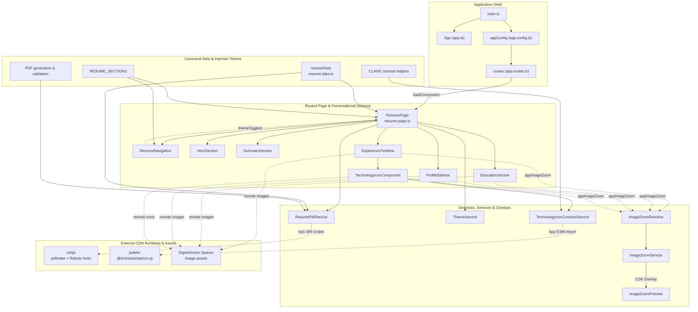

[](https://www.digitalocean.com/?refcode=e2085a54adea&utm_campaign=Referral_Invite&utm_medium=Referral_Program&utm_source=badge)
<br><br><br>
[](https://github.com/prettier/prettier)
[](https://github.com/nawaphonOHM/resume/actions/workflows/dependabot/dependabot-updates)

# Nawaphon Isarathanachaikul — Résumé Portfolio

A public Angular single-page résumé built with Angular Material and Tailwind CSS. It includes responsive section navigation, remembered light and dark themes, browser-print styling, and a user-triggered, phone-redacted PDF download.

## Requirements

- Node.js 22.22.3 or newer
- npm 10

## Install and run locally

```bash
npm ci
npm start
```

Open `http://localhost:4200/`. The development server reloads when source files change.

## Architecture & Component Graph

The project follows a modular, standalone Angular architecture with a lazy routed page, typed canonical data, focused UI sections, and browser-only runtime integrations.



- **Application Shell:** `main.ts` bootstraps the standalone `App` with `appConfig`; the route configuration lazy-loads the résumé page.
- **Routed Components:** `ResumePage` coordinates the résumé sections, navigation, responsive behavior, and presentation of the canonical profile content.
- **Services & Overlays:** Theme and PDF services handle browser capabilities, while the image-zoom directive delegates overlay rendering to `ImageZoomService` and `ImageZoomPreview`; the technology icon component uses the contrast service.
- **Data & Helper Tokens:** `resumeData` is the canonical résumé source, `RESUME_SECTIONS` supplies shared section metadata, and dedicated PDF and CLAHE helpers keep specialized processing separate from components.
- **External Runtime CDNs:** `cdnjs` supplies the on-demand PDF runtime and Roboto fonts, `jsdelivr` supplies OpenCV, and DigitalOcean Spaces hosts the remote image assets.

## Computer Science Concepts & Prerequisites

To understand the implementation and maintain the codebase, familiarity with the following Computer Science and web-platform concepts is helpful:

### 1. Computer Vision & Digital Image Processing

- **Contrast Limited Adaptive Histogram Equalization (CLAHE):** The technology-icon pipeline applies CLAHE to local image regions, improving contrast without unbounded amplification of noise. `TechnologyIconContrastService` chooses an adaptive tile grid and evaluates the enhanced result against the original (`src/app/resume/experience-timeline/technology-icon/service/technology-icon-contrast/technology-icon-contrast.service.ts`).
- **CIE Lab color space:** OpenCV converts pixels from RGBA to RGB and then to CIE $L^*a^*b^*$. CLAHE changes only the lightness channel ($L^*$), while the chromaticity channels ($a^*$ and $b^*$) are retained before conversion back to RGB in the same service.

### 2. Color Science & Photometry

- **sRGB gamma linearization:** `linearize-channel.function.ts` converts gamma-encoded sRGB channels to linear-light values with the standard piecewise transfer function (`src/app/helper/injection-token/linearize-channel.function.ts`).
- **WCAG 2.1 relative luminance and contrast:** `relative-luminance.function.ts` applies $Y = 0.2126R + 0.7152G + 0.0722B$ to those linear channels. The contrast service then computes $(L_1 + 0.05) / (L_2 + 0.05)$, selecting the higher-scoring light or dark card surface (`src/app/helper/injection-token/relative-luminance.function.ts`, `src/app/resume/experience-timeline/technology-icon/service/technology-icon-contrast/technology-icon-contrast.service.ts`).
- **Alpha compositing:** Transparent icon pixels are composited over each candidate surface with source-over RGB blending, and their alpha values weight the contrast score. This calculation is implemented in `TechnologyIconContrastService`, rather than in the linearization or luminance injection tokens.

### 3. Asynchronous Concurrency & Cooperative Scheduling

- **Cooperative idle scheduling:** `requestIdleCallback` (with a timeout fallback) defers canvas rasterization and OpenCV initialization until after the initial render, reducing main-thread jank in `TechnologyIconContrastService`.
- **Exponential backoff with a fixed jitter term:** OpenCV CDN retries use an exponentially increasing delay plus the configured jitter value (`src/app/helper/injection-token/open-cv-retry-delay-multiplier.variable.ts`, `src/app/helper/injection-token/open-cv-retry-jitter-ms.variable.ts`). The current implementation does not generate random jitter.
- **In-flight Promise deduplication:** `TechnologyIconContrastService` caches optimization promises by icon and intrinsic size, while `ResumePdfService` caches the PDF runtime promise and clears it after failure so a later request can retry (`src/app/resume/experience-timeline/technology-icon/service/technology-icon-contrast/technology-icon-contrast.service.ts`, `src/app/resume/resume-page/service/resume-pdf/resume-pdf.service.ts`).

### 4. Memory Management & WebAssembly Interop

- **Explicit native allocation cleanup:** JavaScript garbage collection does not own C++ objects allocated in the OpenCV WebAssembly heap. The CLAHE pipeline explicitly disposes `Mat`, `MatVector`, `Size`, and `CLAHE` objects in a `finally` block through `.delete()` (`src/app/helper/injection-token/dispose.function.ts` and `src/app/resume/experience-timeline/technology-icon/service/technology-icon-contrast/technology-icon-contrast.service.ts`).

### 5. Computational Geometry & DOM Observers

- **Viewport geometry and collision prevention:** `ImageZoomService` uses overlay rectangles from `getBoundingClientRect()`, viewport margins, and min/max bounds to keep popover previews within the viewport, including after CDK positioning (`src/app/resume/image-zoom-preview/service/image-zoom.service.ts`).
- **Layout stabilization:** `ResizeObserver` repositions a preview when image decoding or layout changes its size. `ResumePage` uses `MutationObserver` to wait for deferred boundary markers before opening the native print dialog (`src/app/resume/image-zoom-preview/service/image-zoom.service.ts`, `src/app/resume/resume-page/resume-page.ts`).

### 6. Web Security & Cryptography

- **Subresource Integrity (SRI) and CSP alignment:** Pinned pdfmake CDN assets carry SHA-512 integrity digests in `src/app/helper/injection-token/pdfmake-core-asset.variable.ts` and `src/app/helper/injection-token/pdfmake-font-asset.variable.ts`; `src/app/helper/injection-token/create-cdn-script-loader.function.ts` applies them. Deployments must allow the corresponding CDN origins in `script-src`.
- **Client-side binary validation and privacy checks:** Before download side effects, `src/app/helper/injection-token/validate-resume-pdf-bytes.function.ts` verifies the PDF magic bytes (`%PDF-`), minimum size, required links, and rejects `tel:` content. This is a structural and privacy safeguard, not a replacement for cryptographic signing of generated PDFs.

## Edit résumé content

All publishable résumé facts live in `src/app/data/resume/resume.data.ts` and conform to the contracts in `src/app/helper/interface/resume-profile/resume-profile.interface.ts`. Update that data source rather than duplicating content in component templates.

The phone value must remain `Available on request`. Do not add a phone number, a `tel:` link, or the private source PDF anywhere under the project.

## Static assets

All project-owned images are served from the DigitalOcean Space origin `https://resume-images.ohm-mho.space`. Résumé and technology image object keys start directly with the root-level `/company-logos/...`, `/link-logos/...`, `/technology-icons/...`, or `/university-logos/...` category paths. The favicon is served separately from `/favicon.svg`, and object URLs must not include `/public`.

The Space must allow unauthenticated public `GET` requests. It must also return an appropriate `Access-Control-Allow-Origin` header for canvas-based technology-icon contrast optimization. If an image or CORS access fails, the application does not use a local fallback or custom placeholder.

The résumé PDF is generated in the browser and is not a local static asset. There is no stable `/downloads/...` PDF URL to configure or deploy.

## On-demand résumé PDF

Activating either Download PDF control generates the résumé directly from the canonical typed résumé data. Only after the first activation, the browser loads these immutable cdnjs assets in order (core first, then the Roboto virtual fonts):

- `https://cdnjs.cloudflare.com/ajax/libs/pdfmake/0.3.3/pdfmake.min.js` (`sha512-EkS5jkn3vXRWIdphIy51xskMZggNip3Or8kpe/FlM5XaQeiK2GZJ9OwrIEbXl6txKWsHNtm4OXtxzkkz41Mspw==`)
- `https://cdnjs.cloudflare.com/ajax/libs/pdfmake/0.3.3/vfs_fonts.min.js` (`sha512-rpvsrDF7BNgiFOXqkKyyoJ46jZ8nwQ3NJJAmpYnYKuZHfzwR2wpz5cAaPX09RCj9un5E+ErATIqy4CZBcuNogA==`)

Both scripts use Subresource Integrity, anonymous CORS, and a no-referrer policy. Successful and in-flight loads are reused, while a CDN outage, blocked script, integrity mismatch, or incompatible runtime fails the current request without creating a download and leaves both controls retryable. Production has no bundled fallback.

Deployments that enforce Content Security Policy must allow `https://cdnjs.cloudflare.com` in `script-src`. Do not use cdnjs's `latest` alias. When upgrading, update both pinned CDN versions, both published SRI hashes, and the exact development-only `pdfmake` version together; the npm package is used solely as the network-independent integration-test fixture.

Before starting the download, the application verifies the PDF header, minimum size, required links, content safeguards, and absence of phone or `tel:` data. Installation, production builds, and initial page loads perform no PDF generation.

## Runtime OpenCV dependency

Technology-icon contrast optimization is browser-only and begins after the initial render during idle time. When optimization starts, the browser dynamically imports OpenCV from `https://cdn.jsdelivr.net/npm/@techstark/opencv-js/+esm`; OpenCV is not installed as an npm dependency or included in the application chunks.

Deployments that enforce Content Security Policy must allow `https://cdn.jsdelivr.net` in the applicable `script-src` policy. If the CDN module is unavailable, blocked, or cannot enhance an icon, the application remains usable and displays the original icon on a light background.

## Formatting and tests

```bash
npm run format
npm run format:check
npm test
```

Prettier formats TypeScript, Angular templates, styles, JSON, and Markdown. The test command runs the Angular/Vitest suite, including the PDF document, privacy, lazy-loading, download, and retry coverage.

## Production build

```bash
npm run build
```

The production command compiles only the Angular application. It emits neither a generated résumé PDF nor bundled or lazy `pdfmake`/virtual-font runtime chunks, and its `index.html` contains no eager cdnjs script tag, preconnect, or preload for them. The first PDF-runtime request occurs only after a user activates a Download PDF control.

Upload the contents of this directory to a web root:

```text
dist/resume/browser/
```

The output is host-neutral and requires no backend, runtime API, route rewrites, or server-side rendering.

## Useful scripts

| Command                | Purpose                                         |
| ---------------------- | ----------------------------------------------- |
| `npm start`            | Run the Angular development server.             |
| `npm run watch`        | Continuously create development builds.         |
| `npm run build`        | Produce the static Angular deployment artifact. |
| `npm test`             | Run the Angular/Vitest test suite once.         |
| `npm run format`       | Format the project with Prettier.               |
| `npm run format:check` | Verify formatting without changing files.       |
